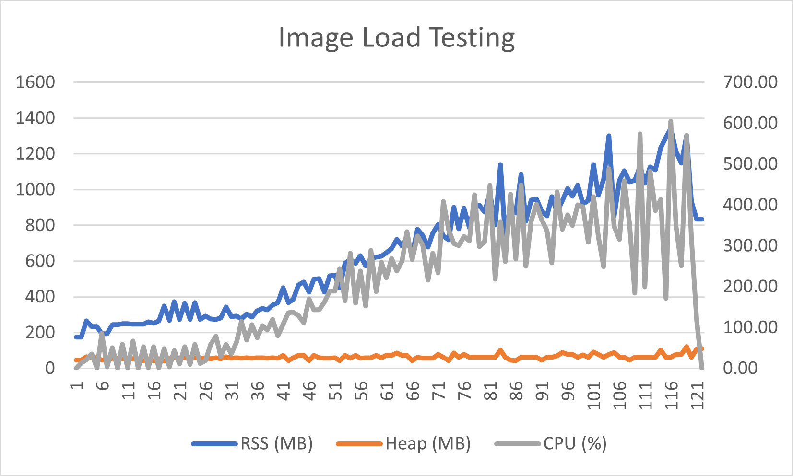
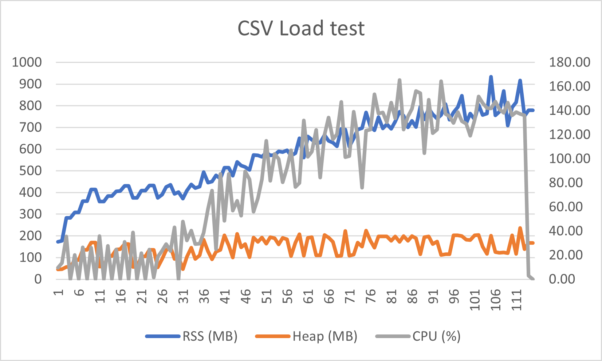
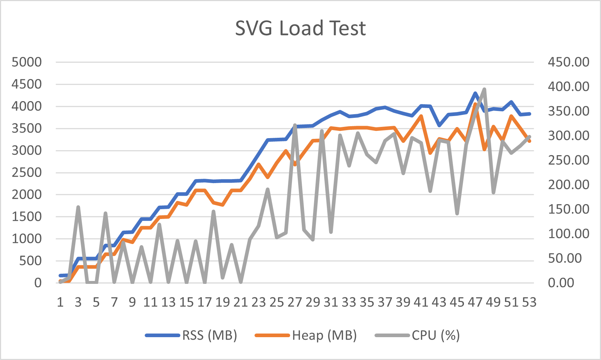

# Load Testing — File Safety API

Before promoting the API, I load-tested the `/v1/sanitize` endpoint to understand how it behaves under concurrent uploads — specifically its memory and CPU usage, since a burst of simultaneous file processing could crash the server or (on usage-metered hosting) spike costs. The testing surfaced a serious problem and directly shaped the protections the service now has.

## Method

- **Tool:** [k6](https://k6.io/) — ramping virtual users (concurrent uploaders) from 1 → 50 over staged intervals.
- **Endpoint:** `POST /v1/sanitize` (real files, real sanitization pipeline).
- **Monitoring:** the server logged its own `process.memoryUsage()` (RSS + heap) and `process.cpuUsage()` once per second during each run.
- **File types tested separately:** image (JPEG), CSV (50,000 rows), and SVG (~20,000 elements) — because each type runs through different code (sharp, csv-parse, DOMPurify) with very different resource profiles.

Run it yourself:

In the index.js, at the very end of the file, add the following code:

```js
let lastCpu = process.cpuUsage()
let lastTime = Date.now()

setInterval(() => {
    const m = process.memoryUsage()
    const now = Date.now()
    const cpu = process.cpuUsage(lastCpu)        // CPU used since last check
    const elapsedMs = now - lastTime
    // CPU % = (cpu microseconds / elapsed microseconds) * 100, across cores
    const cpuPercent = ((cpu.user + cpu.system) / 1000 / elapsedMs * 100).toFixed(1)
    lastCpu = process.cpuUsage()
    lastTime = now

    console.log(
        `RSS: ${(m.rss/1024/1024).toFixed(0)}MB | ` +
        `Heap: ${(m.heapUsed/1024/1024).toFixed(0)}MB | ` +
        `CPU: ${cpuPercent}%`
    )
}, 1000)
```
This logs the CPU and memory usage 

then in one terminal start the script
```bash
npm start
```
Then in another terminal start k6

```bash
# server running locally with memory logging, test key limit raised
cd loadTest
k6 run -e FILE=../test-fixtures/large-image.jpg -e TEST_API_KEY=your-test-key loadtest.k6.js
k6 run -e FILE=../test-fixtures/large-csv.csv -e TEST_API_KEY=your-test-key loadtest.k6.js
k6 run -e FILE=../test-fixtures/large-svg.svg -e TEST_API_KEY=your-test-key loadtest.k6.js
```

## Findings — three very different risk profiles


```bash
  █ THRESHOLDS 

    http_req_duration
    ✓ 'p(95)<15000' p(95)=8.09s

    http_req_failed
    ✓ 'rate<0.05' rate=0.00%


  █ TOTAL RESULTS 

    checks_total.......: 486     3.636466/s
    checks_succeeded...: 100.00% 486 out of 486
    checks_failed......: 0.00%   0 out of 486

    ✓ status is 200

    HTTP
    http_req_duration..............: avg=3.67s min=989.99ms med=3.2s max=10.47s p(90)=7.46s p(95)=8.09s
      { expected_response:true }...: avg=3.67s min=989.99ms med=3.2s max=10.47s p(90)=7.46s p(95)=8.09s
    http_req_failed................: 0.00%  0 out of 486
    http_reqs......................: 486    3.636466/s

    EXECUTION
    iteration_duration.............: avg=4.67s min=1.99s    med=4.2s max=11.48s p(90)=8.47s p(95)=9.1s 
    iterations.....................: 486    3.636466/s
    vus............................: 6      min=1        max=50
    vus_max........................: 50     min=50       max=50

    NETWORK
    data_received..................: 3.3 GB 24 MB/s
    data_sent......................: 4.5 GB 34 MB/s

running (2m13.6s), 00/50 VUs, 486 complete and 0 interrupted iterations
default ✓ [======================================] 00/50 VUs  2m10s
```



```bash
  █ THRESHOLDS 

    http_req_duration
    ✓ 'p(95)<15000' p(95)=8.42s

    http_req_failed
    ✓ 'rate<0.05' rate=0.00%


  █ TOTAL RESULTS 

    checks_total.......: 453     3.394981/s
    checks_succeeded...: 100.00% 453 out of 453
    checks_failed......: 0.00%   0 out of 453

    ✓ status is 200

    HTTP
    http_req_duration..............: avg=3.92s min=882.76ms med=3.6s max=11.39s p(90)=7.56s p(95)=8.42s
      { expected_response:true }...: avg=3.92s min=882.76ms med=3.6s max=11.39s p(90)=7.56s p(95)=8.42s
    http_req_failed................: 0.00%  0 out of 453
    http_reqs......................: 453    3.394981/s

    EXECUTION
    iteration_duration.............: avg=4.92s min=1.88s    med=4.6s max=12.4s  p(90)=8.57s p(95)=9.42s
    iterations.....................: 453    3.394981/s
    vus............................: 5      min=1        max=50
    vus_max........................: 50     min=50       max=50

    NETWORK
    data_received..................: 2.2 GB 17 MB/s
    data_sent......................: 1.5 GB 11 MB/s

running (2m13.4s), 00/50 VUs, 453 complete and 0 interrupted iterations
default ✓ [======================================] 00/50 VUs  2m10s
```



```bash
  █ THRESHOLDS 

    http_req_duration
    ✓ 'p(95)<15000' p(95)=0s

    http_req_failed
    ✗ 'rate<0.05' rate=95.74%


  █ TOTAL RESULTS 

    checks_total.......: 1174   9.019971/s
    checks_succeeded...: 4.25%  50 out of 1174
    checks_failed......: 95.74% 1124 out of 1174

    ✗ status is 200
      ↳  4% — ✓ 50 / ✗ 1124

    HTTP
    http_req_duration..............: avg=516ms min=0s    med=0s    max=32.09s p(90)=0s     p(95)=0s    
      { expected_response:true }...: avg=8.86s min=1.53s med=8.23s max=23.87s p(90)=17.44s p(95)=20.26s
    http_req_failed................: 95.74% 1124 out of 1174
    http_reqs......................: 1174   9.019971/s

    EXECUTION
    iteration_duration.............: avg=1.75s min=1s    med=1s    max=33.1s  p(90)=1s     p(95)=5.23s 
    iterations.....................: 1174   9.019971/s
    vus............................: 5      min=1            max=50
    vus_max........................: 50     min=50           max=50

    NETWORK
    data_received..................: 83 MB  635 kB/s
    data_sent......................: 70 MB  541 kB/s

running (2m10.2s), 00/50 VUs, 1174 complete and 0 interrupted iterations
default ✓ [======================================] 00/50 VUs  2m10s
ERRO[0130] thresholds on metrics 'http_req_failed' have been crossed
```


| File type | Peak RSS | Bottleneck | Outcome under load |
|-----------|----------|------------|--------------------|
| **Image (JPEG)** | ~200-1200 MB | Memory + CPU (native, via sharp/libvips) | Survived; latency stayed low (p95 ~2.7s), but second test it climbed to 8.09s ( see chart for second test ) |
| **CSV (50k rows)** | ~100-950 MB | CPU — synchronous parsing **blocks the event loop** | Survived, at first latency exploded (p95 ~29s) and connections were reset, but second test showed around 8.42s ( see chart for second test ) |
| **SVG (20k elements)** | **~4 GB → crash** | JS heap — DOMPurify builds a full DOM in the V8 heap | **Fatal out-of-memory: the Node process died** |

### Image — memory-heavy but bounded

sharp decodes images into raw pixels, which is memory-intensive, and it uses native threads (CPU climbed to ~600% / 6 cores at peak). But memory stayed bounded and the process never fell over. This is the "expected" heavy path, and it's manageable.

### CSV — CPU-bound and event-loop-blocking

Parsing a 50,000-row CSV is CPU-heavy **and synchronous**, so under concurrency it jammed Node's single-threaded event loop. Memory stayed modest, but latency climbed past 30 seconds and the server began resetting connections. A synchronous operation like this can't be interrupted mid-parse, so a timeout can't rescue it — the fix is to limit concurrency and cap input size.

### SVG — the worst case: an out-of-memory crash

SVG was dramatically worse than either of the others. DOMPurify parses the entire SVG into a DOM tree that lives in the **JavaScript heap** (unlike sharp's native memory). Under concurrency, many large DOM trees existed at once, the heap climbed relentlessly, and at ~4 GB it hit V8's heap ceiling:

```
WARN[0128] Request Failed                                error="Post \"http://localhost:3000/v1/sanitize\": dial tcp 127.0.0.1:3000: connectex: No connection could be made because the target machine actively refused it."
INFO[0128] status=0 body=null                            source=console
```

```
FATAL ERROR: Ineffective mark-compacts near heap limit
Allocation failed - JavaScript heap out of memory
```

The entire Node process crashed — not just one failed request. Every subsequent request got "connection refused" because the server was dead. This is also a denial-of-service surface: a small but complex SVG could deliberately crash the service.


## What this changed, The fix

- **A global concurrency limiter** so only a bounded number of sanitizations run at once, with a short queue and a fast `503` when saturated — this caps peak memory regardless of traffic bursts (and, on usage-metered hosting, caps cost).
- **Conservative file-size limits** per plan, since a single large file's in-memory footprint is far bigger than its bytes on disk.
- **Image pixel and processing-time limits** (via sharp's `limitInputPixels` and `.timeout()`) to reject decompression-bomb images.
- **SVG-specific limits** (tight size / complexity caps), because SVG is the highest-risk path and the concurrency limiter alone may not prevent a heap blow-up from concurrent large SVGs.
- **CSV-specific limits** (row-count and size caps), rejecting oversized spreadsheets before the synchronous parse can block the event loop.

## Takeaway

Testing each file type separately mattered: the three paths (native image processing, synchronous CSV parsing, in-heap DOM sanitization) fail in completely different ways, and only the SVG path actually crashed the process. Load testing was necessary and proved that the fixes were needed.